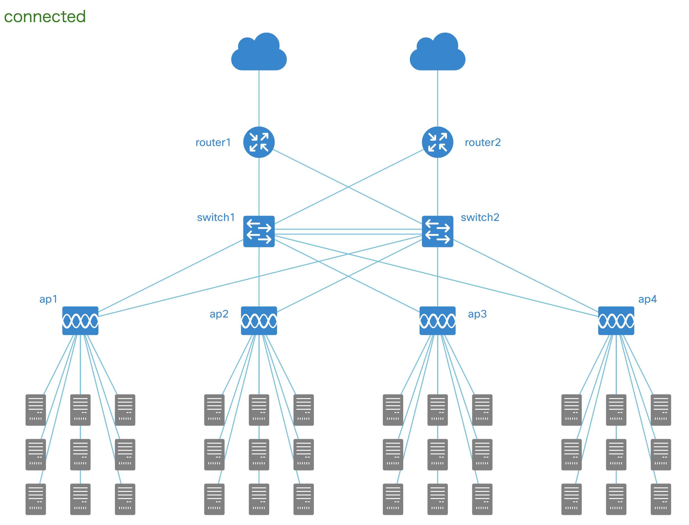
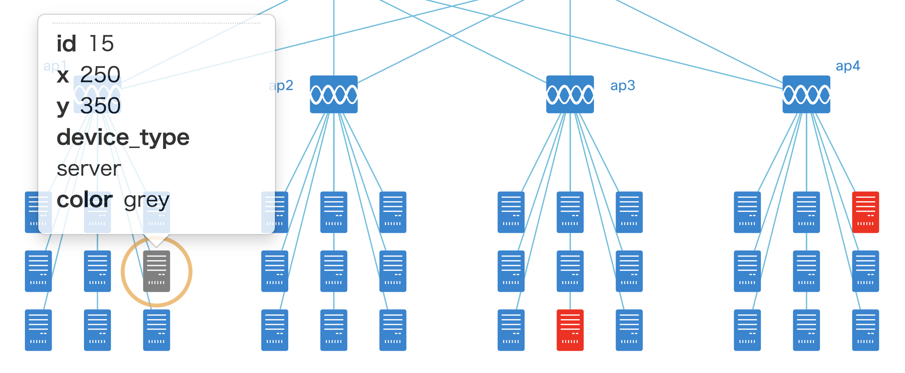
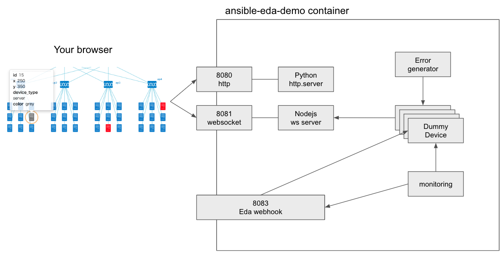

コンテナを起動
```
docker run -d --name eda-demo -p 8080:8080 -p 8081:8081 -p 8082:8082 irixjp/ansible-eda-demo:latest
```

ブラウザで `http://localhost:8080/` へアクセス



コンソールへ接続
```
docker exec -it eda-demo bash
cd /root/nodejs
```

デモパーツの状態を確認
```
supervisorctl status
```

ダミーデバイスを起動
```
supervisorctl start devices:*
```




エラー発生機を起動（ランダムにダミーデバイスを壊す）
```
supervisorctl start err_generator
```

ブラウザで壊れた機器のIDを確認して、コマンドで復旧
```
./device_ops.sh 31 active
./device_ops.sh 13 active
./device_ops.sh 37 active
```

イベントモニターを起動（ダミーデバイスの状態を確認して、おかしくなっていれば webhook を送信）
```
supervisorctl start monitoring
```

EDAを起動(webhookを受け取って起動)
```
ansible-rulebook -i inventory -r eda_rulebook.yaml -v
```

全体概要



